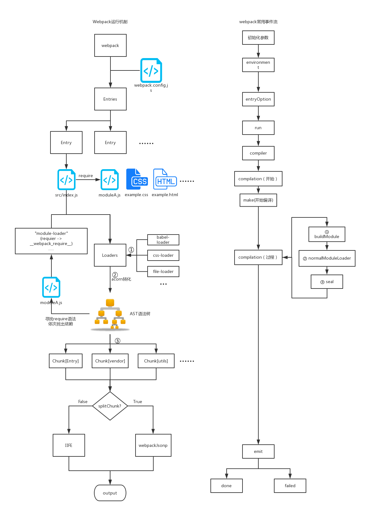

# this is readme

to practice react+ts+webpack

[commit 规范--阮一峰](https://www.ruanyifeng.com/blog/2016/01/commit_message_change_log.html)

</img>

**javascript**

```
// 比较/匹配
[] == ![] // true
NaN !== NaN // true
[] == ''   // -> true
[] == 0    // -> true
[''] == '' // -> true
[0] == 0   // -> true
[0] == ''  // -> false
[''] == 0  // -> true

1 == true // true
2 == true // false
"2" == true // flase

null > 0 // false
null < 0 // false
null == 0 // false
null >= 0 // true

// 加法
true + 1 // 1
undefined + 1 // NaN

let obj = {};

{} + 1 // 1，这里的 {} 被当成了代码块
{ 1 + 1 } + 1 // 1

obj + 1 // [object Object]1
{} + {} // Chrome 上显示 "[object Object][object Object]"，Firefox 显示 NaN
1+{a:1} // 1[object Object]
[] + {} // [object Object]
[] + a // [object Object]
+ [] // 等价于 + "" => 0
{} + [] // 0
a + [] // [object Object]

[2,3] + [1,2] // '2,31,2'
[2] + 1 // '21'
[2] + (-1) // "2-1"

//baNaNa
'b' + 'a' + + 'a' + 'a' // -> baNaNa
'foo' + + 'bar' // -> 'fooNaN'

// 减法或其他操作，无法进行字符串连接，因此在错误的字符串格式下返回 NaN
[2] - 1 // 1
[2,3] - 1 // NaN
{} - 1 // -1
```

到底是为什么呢？ 下面有一个表供快速参考：

```
Number  + Number  -> addition
Boolean + Number  -> addition
Boolean + Boolean -> addition
Number  + String  -> concatenation
String  + Boolean -> concatenation
String  + String  -> concatenation
```

那么其他例子呢？对于`[]`和`{}`，toPrimitive 和 toString 方法会在加法操作前被隐式地调用。

-
